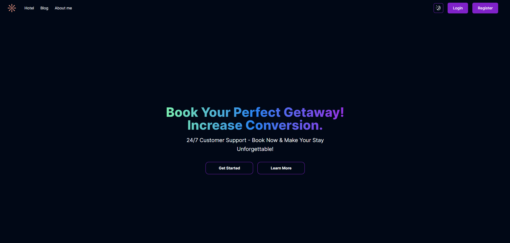

# Hotel Booking &middot; [](https://hotel-booking-phi-nine.vercel.app/) [](https://www.npmjs.com/package/npm) [](https://github.com/vn-vietnam)




## Table of Contents

- [Introduction](#Introduction) 
- [Features](#Features) 
- [Technologies](#Technologies) 
- [Running with Docker](#RunningwithDocker) 
- [Installing](#Installing) 
- [Testing](#Testing) 
- [Developing](#Developing) 
- [Prerequisites](#Prerequisites) 
- [Emphasis](#Emphasis) 
- [Setting up Dev](#SettingupDev) 

## Introduction 

- Website hotel booking

## Features

- Book Hotels Conveniently and Quickly:
	- User-friendly booking interface with a calendar for selecting dates.
	- Option to choose room types, specify the number of guests, and add any special requests or preferences.
- Hotel Management and Booking Settings:
	- Admin dashboard for managing hotels, room availability, and pricing.
	- Tools for updating hotel information, including descriptions, photos.
- Customer Reviews and Ratings:
	- Allow registered users to leave reviews and ratings for hotels they've stayed at.
- Hotel Search and Filtering:
	- nteractive maps displaying hotel locations and nearby attractions, with the ability to filter results based on map view.

## Technologies 

NextJs - TypeScript - Sanity - Tailwind

## Running with Docker 

```shell
docker compose up
```

## Installing

A quick introduction of the minimal setup you need to get a hello world up &
running.

```shell
npm run dev
```

## Testing

```shell
User: test@gmail.com
Pass: 123456
```

## Developing

```shell
http://localhost:3000
http://localhost:3000/studio
```

Admin page with - /studio

### Prerequisites

Please check file .env.sample

### Setting up Dev

Here's a brief intro about what a developer must do in order to start developing
the project further:

```shell
git clone https://github.com/vn-vietnam/hotel-booking.git
cd hotel-booking/
npm install
```
